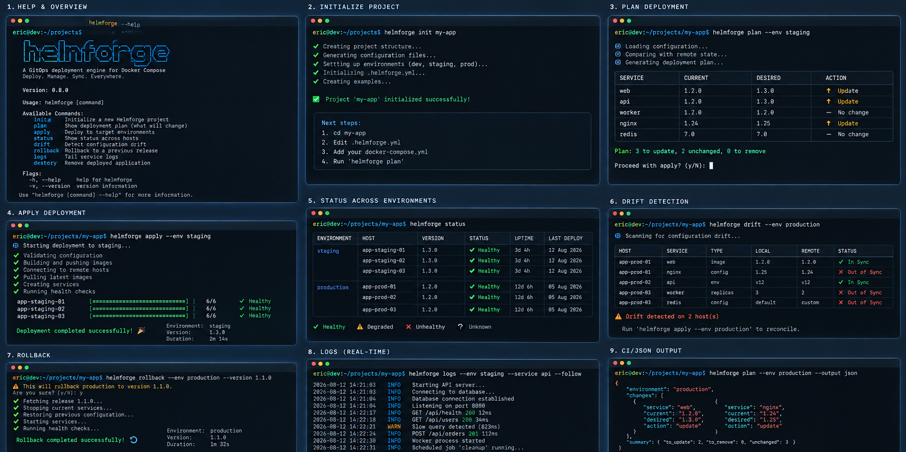

# helmforge

A GitOps-style deployment engine that deploys apps to remote Linux hosts via SSH using Docker Compose. Uses a Git repository as the source of truth.

## Screenshots



## Features

- **init** — Scaffold a new project: `.helmforge.yml`, environments, and starter app config
- **plan** — Preview deployment actions without executing anything
- **apply** — Deploy with rolling strategy, health checks, and automatic rollback on failure
- **status** — View latest release and per-host deployment status
- **drift** — Detect when remote state diverges from desired Git state
- **rollback** — Re-deploy a previous release by ID
- **logs** — Tail `docker compose` logs from the hosts an app runs on
- **destroy** — Stop and remove a deployed app from its target hosts

## Install

```bash
# Build from source (requires Go 1.21+)
go build -o helmforge ./cmd/helmforge

# Or install directly
go install github.com/7irelo/helmforge/cmd/helmforge@latest
```

**Prerequisites on your local machine:**
- `git` CLI
- `ssh` / `scp` CLI (with key-based auth configured)

**Prerequisites on remote hosts:**
- Docker + `docker compose` (v2 plugin)
- SSH access for the deploy user

## Repository Layout

helmforge reads config from a Git repository with this structure:

```
repo/
  environments/
    staging/
      apps/
        reporting-service/
          app.yaml              # App config (required)
          docker-compose.yaml   # Compose file (required)
          .env.example          # Optional reference
    prod/
      apps/
        reporting-service/
          app.yaml
          docker-compose.yaml
```

## app.yaml Schema

```yaml
app: reporting-service          # Application name (required)
env: staging                    # Environment (required)
targets:                        # Deploy targets (at least one required)
  - host: 10.0.1.10            # Hostname or IP (required)
    user: deploy                # SSH user (required)
    port: 22                    # SSH port (default: 22)
    path: /opt/apps/reporting   # Remote path for compose files (required)
  - host: 10.0.1.11
    user: deploy
    path: /opt/apps/reporting
source:
  type: compose                 # Must be "compose" (required)
  composeFile: docker-compose.yaml  # Compose file name (required)
deploy:
  strategy: rolling             # Deploy strategy (default: rolling)
  health:
    type: http                  # Health check type: "http" or "none"
    url: http://10.0.1.10:8080/health
    timeoutSeconds: 30          # Default: 30
policy:
  allowedBranches:              # Optional: restrict deployable branches
    - main
    - staging
  requireCleanWorktree: true    # Optional (default: false)
  requireSignedCommits: false   # Optional (default: false)
```

## Usage

### Init

Scaffold a new project:

```bash
helmforge init my-app
```

This creates `.helmforge.yml` plus an `environments/<env>/apps/my-app/` tree
(with a starter `app.yaml` and `docker-compose.yaml`) for each of `dev`,
`staging` and `prod`. Use `--env` to choose different environments:

```bash
helmforge init my-app --env staging,prod
```

`.helmforge.yml` supplies default values for `--repo`, `--ref`, `--app` and the
environment, so inside a project directory you can run the short form:

```bash
helmforge plan --env staging     # instead of repeating --app and --repo
```

Explicit flags always override the project file.

### Plan

Preview what will happen during deployment:

```bash
helmforge plan -e staging -a reporting-service --repo git@github.com:org/infra.git
```

Sample output:
```
Deployment Plan
===============
  App:    reporting-service
  Env:    staging
  Repo:   git@github.com:org/infra.git
  Ref:    main
  Commit: a1b2c3d4e5f6

Host: deploy@10.0.1.10:22
  --------------------------------------------------
  + [ensure_dir] Create remote directory /opt/apps/reporting
      cmd: mkdir -p /opt/apps/reporting
  ~ [copy_files] Copy docker-compose.yaml to 10.0.1.10:/opt/apps/reporting
  > [docker_pull] Pull latest images
      cmd: cd /opt/apps/reporting && docker compose pull
  > [docker_up] Start/update services
      cmd: cd /opt/apps/reporting && docker compose up -d --remove-orphans
  ? [health_check] HTTP health check http://10.0.1.10:8080/health (timeout 30s)
  * [write_marker] Write release marker file

Host: deploy@10.0.1.11:22
  --------------------------------------------------
  ...
```

JSON output for CI:
```bash
helmforge plan -e staging -a reporting-service --repo git@github.com:org/infra.git --json
```

```json
{
  "env": "staging",
  "app": "reporting-service",
  "repo": "git@github.com:org/infra.git",
  "ref": "main",
  "commit_sha": "a1b2c3d4e5f6789...",
  "actions": [
    {
      "host": "deploy@10.0.1.10:22",
      "step": "ensure_dir",
      "description": "Create remote directory /opt/apps/reporting",
      "command": "mkdir -p /opt/apps/reporting"
    },
    ...
  ]
}
```

### Apply

Execute the deployment:

```bash
# Serial deployment (default)
helmforge apply -e staging -a reporting-service --repo git@github.com:org/infra.git

# Deploy up to 3 hosts in parallel
helmforge apply -e staging -a reporting-service --repo git@github.com:org/infra.git --max-parallel 3

# Deploy a specific branch/tag/commit
helmforge apply -e staging -a reporting-service --repo git@github.com:org/infra.git --ref v1.2.3
```

Sample output:
```
Deployment Plan
===============
  App:    reporting-service
  Env:    staging
  ...

Executing deployment...

Release: rel-1708617234567890
  Status:    success
  App:       reporting-service
  Env:       staging
  Commit:    a1b2c3d4
  Started:   2025-02-22 15:00:00 UTC
  Finished:  2025-02-22 15:00:45 UTC
  Duration:  45s

  Host Results:
    HOST        STATUS   ERROR
    10.0.1.10   success
    10.0.1.11   success
```

### Status

Check the current deployment status:

```bash
helmforge status -e staging -a reporting-service

# With drift detection (compares remote marker to current Git HEAD)
helmforge status -e staging -a reporting-service --repo git@github.com:org/infra.git
```

### Drift

Check for configuration drift across all apps in an environment:

```bash
# Check all apps
helmforge drift -e staging --repo git@github.com:org/infra.git --all

# Check specific apps
helmforge drift -e staging --repo git@github.com:org/infra.git reporting-service
```

Sample output:
```
Drift Report for staging (desired: a1b2c3d4)
===========================================
  reporting-service/10.0.1.10  InSync      a1b2c3d4 -> a1b2c3d4
  reporting-service/10.0.1.11  OutOfSync   a1b2c3d4 -> 9f8e7d6c
```

### Rollback

Roll back to a previous release:

```bash
helmforge rollback -e staging -a reporting-service --to rel-1708617234567890
```

### Logs

Tail `docker compose` logs from the hosts an app is deployed to:

```bash
# Last 100 lines from every service
helmforge logs --env staging --app reporting-service

# Follow one service until interrupted
helmforge logs --env staging --service api --follow
```

When an app has multiple target hosts, each line is prefixed with its host.
Use `--host` to restrict output to one, and `--tail` to change how much
history is shown.

### Destroy

Stop and remove a deployed app from its target hosts:

```bash
helmforge destroy --env staging --app reporting-service
```

This runs `docker compose down --remove-orphans` on every target and deletes
the release marker. It prompts before doing anything; pass `--yes` to skip the
prompt in CI. Add `--volumes` to remove named volumes as well, and `--purge` to
delete the remote deployment directory.

Release history is left intact, so `helmforge rollback` can still redeploy a
previous release afterwards.

### Global Flags

```
-v, --verbose    Enable verbose/debug logging
    --log-json   Use structured JSON logging (for CI/log aggregation)
    --version    Print the helmforge version
```

Read commands (`plan`, `status`, `drift`) also accept `-o` / `--output` with
`text` or `json`, equivalent to `--json`:

```bash
helmforge plan --env production --output json
```

## Architecture

```
cmd/helmforge/main.go           Entry point
internal/
  core/
    model/                      Domain types (AppConfig, Release, Plan, etc.)
    validate/                   YAML config parsing + validation
    plan/                       Plan generation (read-only)
    reconcile/                  Apply engine (deploy, drift check)
    release/                    Output formatting (text, JSON)
  adapters/
    git/                        Git operations (shells out to git CLI)
    remote/                     SSH execution (shells out to ssh/scp)
    health/                     HTTP health checking
    store/                      SQLite release storage
  cli/
    commands/                   Cobra CLI commands
  util/
    log/                        Structured logging (zerolog)
    lock/                       File-based deploy locking
```

All adapters are behind interfaces for testability. Core logic depends only on interfaces, not concrete implementations.

## Safety

- **Ctrl+C handling**: Cancellation stops further host deploys and marks release as cancelled
- **Deploy locking**: File-based lock prevents concurrent deploys for the same env/app
- **Rolling strategy**: Deploy host-by-host, stop on first failure
- **Release tracking**: Every deploy is recorded in local SQLite with per-host results
- **Drift detection**: Remote marker file tracks deployed commit SHA

## Secrets

For v1, helmforge does NOT manage secrets directly. Recommended approaches:
- Pre-provision `.env` files or Docker secrets on the host
- Use an external decrypt command hook
- Use a secrets manager that injects env vars at runtime

## Local test harness

`hack/local-harness.sh` stands up a throwaway SSH deploy target so the full
lifecycle can be exercised without touching a real host. The target is a
container running sshd with the Docker CLI and compose plugin, talking to the
host daemon over the mounted socket, so deployed containers appear on the host.

```bash
./hack/local-harness.sh up     # build image, start target, seed a gitops repo
./hack/local-harness.sh demo   # plan, apply, status, logs, drift, destroy
./hack/local-harness.sh down   # remove the container, image and ssh entry
```

The seeded app deliberately names its compose file `compose.prod.yml` rather
than `docker-compose.yml`, so that the `-f` handling is actually exercised.

## Running Tests

```bash
go test ./...
```

## License

MIT
